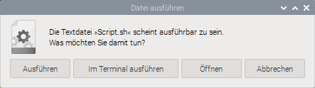
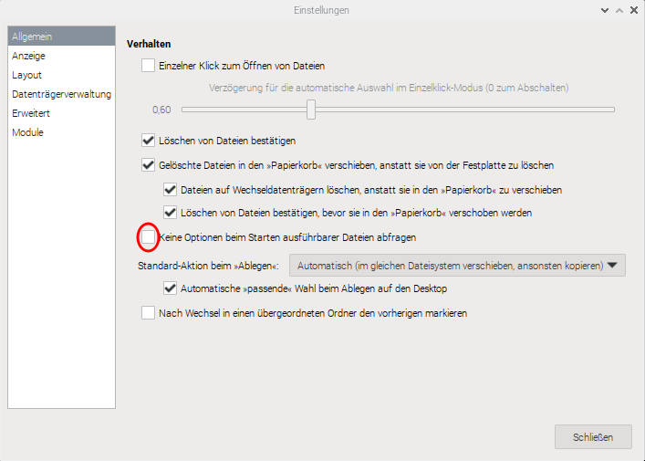

# Linux Stuff

  1. [Basic Software](#basic-software)
  2. [Shell Stuff](#shell-stuff)
  3. [Installing Java](#installing-java)
  4. [Installing IntelliJ IDEA](#installing-intellij-idea)
  5. [Installing Arduino IDE](#installing-arduino-ide)
  6. [Installing Go](#installing-go)
  7. [Integrate Applications into the GUI Desktop](#integrate-applications-into-the-gui-desktop)
  8. [Miscellaneous Stuff](#updating-the-gradle-wrapper)

---

## Basic Software

This is a list of software that I will install on each Linux machine that I work with. Some are less useful on Raspberry&nbsp;Pi machines, others I do not need on desktops and/or laptops.

Configuration files and scripts can be found in the *ChangeManagement* repository .

| | Ubuntu Desktop | Ubuntu Laptop | Raspberry Pi OS |
| :---: | :---: | :---: | :---: |
| `joe` | x | x | x |
| `curl` | x | `curl` | `curl` |
| `wget` | x | `wget` | `wget` |
| Java | x | x | x |
| Python 3 | x | x | x |
| Subversion | x | x | x |
| `git` | x | `git` | `git` |
| Git Credential Manager | x | x | x |
| SDKMAN! | x | x | x |
| Gradle | x | x | x |
| Remmina | x | x | x<sup>*</sup> |
| xRDP | | | x |
| GParted | x | x | x<sup>*</sup> |
| FileZilla | x | x | x<sup>*</sup> |

<sup>*</sup> Only for systems with a GUI installed

### `curl`
`curl` is a command line tool for file transfer using the URL syntax. It is preinstalled on most Linux systems, but if not, it can be installed through `apt`.

### FileZilla
FileZilla is a graphical FTP client that supports also SFTP. Use `apt` to install it.

### `git`
`git` is an SCM that excels for distributed source code management, but it is also used a lot for the distribution of software. It will be installed through `apt`.

For my personal use, I prefer [Subversion](#subversion).

### Git Credential Manager
The GCM is used to simplify working with Git repositories. The installation is described [here](https://github.com/git-ecosystem/git-credential-manager).


### GParted
GParted is a partition manager that allows to resize, copy, and move partitions without data loss. Can be useful also on a Raspberry&nbsp;Pi.

Will be installed through `apt`.

### Gradle
The [Gradle Build Tool](https://gradle.org/) is useful to build software and manage all its dependencies. It should be installed on any machine that is used for software development.

Gradle can be installed via `apt` as well as through `snap`, but both sources are usually not providing the latest versions. Therefore the recommended source is [SDKMAN!](https://sdkman.io/). See [here](#sdkman) on how to install "The Software Development Kit Manager" if not yet done.

How to update the Gradle Wrapper is described [here](#configure-joe).

### Java

The latest LTS version of the JDK needs to be available on all machines. Although it could be installed through [SDKMAN!](#sdkman), I prefer to install it manually, the process is described [here](#installing-java).

### `joe`

`joe` (*Joe's Own Editor*) is a simple text editor for the console window that works basically like the old Turbo Pascal editor. It is very similar to the `nano` editor, but I prefer `joe` over `nano`.

`joe` will be installed through `apt`. For the configuration of the editor, see [here](#configure-joe).

### Python 3

Python is an easy-to-learn multi-purpose programming language. Usually the latest version will be installed together with the operating system.

### Remmina

[Remmina](https://remmina.org/) is a tool to access remote systems through `ssh`, `sftp` and `rdp`. I usually install it through `apt` but if this is not working, see [here](https://remmina.org/how-to-install-remmina/).

### SDKMAN!

[SDKMAN!](https://sdkman.io/) is a *packet manager* for software development tools. It will be installed through a shell command. Obviously it makes sense only on machines that are somehow used for software development.

For more information on the usage of SDKMAN!, see [here](https://sdkman.io/usage).

### Subversion

[Apache Subversion](https://subversion.apache.org/) is another version control system, like [`git`](#git). When installed through `apt`, it brings both, the server and the client to the machine.

Mainly the client command `svn` is needed, as I use a Subversion repository for the various configuration files I need (aside that I use it for my own software projects, too).

### `wget`
`wget` is another command line tool to load files from the network. If not already installed, it can be made available through `apt`.

### xRDP

The server for the Remote Desktop protocol, mainly used on the Raspberry&nbsp;Pi systems. For details, see [here](https://github.com/tquadrat/tquadrat.github.io/blob/main/stuff/RaspberryStuff.md#remote-desktop-protocol).

### Installation Commands

The installation of Java is described [here](#installing-java).

  - Through `apt` for FileZilla, `git`, GParted, `joe`, Remmina, Subversion and xRDP:
    - Desktop, Laptop:
      ```console
      sudo apt update
      sudo apt full-upgrade -y
      sudo apt install curl filezilla git gparted joe remmina subversion wget -y
      ```
    - Raspberry&nbsp;Pi:
      ```console
      sudo apt update
      sudo apt full-upgrade -y
      sudo apt install curl filezilla git joe remmina subversion wget xrdp -y
      ```
  - Through shell command for SDKMAN!:

    To check whether "The Software Development Kit Manager" is installed already, execute
    ```console
    sdk version
    ```
    in a shell window. To install it, just execute
    ```console
    curl -s "https://get.sdkman.io" | bash
    ```
    followed by
    ```console
    source "$HOME/.sdkman/bin/sdkman-init.sh"
    ```
  - Through SDKMAN! for Gradle:   
    ```console 
    sdk install gradle
    ```
    This will install the latest version and set it as the default.

---

## Shell Stuff

Some tips and tricks for the Shell, mainly for the Bash shell.

### History

The *bash* history is a powerful feature for the work on the console of a Linux system.

#### [Removing and avoiding Duplicates in the History](https://www.baeldung.com/linux/history-remove-avoid-duplicates)

##### Manual Deduplication

```console
export HISTCONTROL=ignoreboth:erasedups
history -a
history -w
awk '!a[$0]++' $HOME/.bash_history > $HOME/.bash_history.tmp && mv $HOME/.bash_history.tmp $HOME/.bash_history
```

This of course does not remove the duplicates that are already/still hold in memory. Here a reboot or at least a re-login would help.

##### Make it permanent

Add
```shell
export HISTCONTROL=ignoreboth:erasedups
```
to `/etc/rc.local` or to `$HOME/.bashrc` and reboot.

Some distributions may already set `$HISTCONTROL` in `$HOME/.bashrc`.

An enhancement is described [here](https://unix.stackexchange.com/a/556267/280398). This leads to a `$HOME/.bashrc` like this:

```shell
# don't put duplicate lines or lines starting with space in the history.
# See bash(1) for more options
HISTCONTROL=ignoreboth:erasedups

# don't put simple commands to the history
HISTIGNORE=cd:ls:"ls -la":exit

# append to the history file, don't overwrite it
shopt -s histappend

# merge the history for all sessions on close
function historymerge {
    history -n; history -w; history -c; history -r;
}
trap historymerge EXIT

# for setting history length see HISTSIZE and HISTFILESIZE in bash(1)
HISTSIZE=5000
HISTFILESIZE=15000
```

---

## Installing Java

Although [SDKMAN!](https://sdkman.io/) also allows to install a JDK, I prefer to do it manually.

  1. Download the install package from the [Eclipse Temurin Download page](https://adoptium.net/de/temurin/releases/).
   
     Select the latest LTS version of the JDK that fits for the target operation system.

     | Target | Architecture |
     | --- | --- |
     | Ubuntu on Desktop/Laptop | x64 |
     | MacOS on Intel | x64 |
     | MacOS on A# | aarch64 |
     | Windows | x64 |
     | Raspberry Pi OS 64bit | aarch64 |
     | Raspberry Pi OS 32bit | arm |

     Perhaps some versions are not available for all targets.
     
  2. Create the target folder:
     ```console
     cd /opt
     sudo mkdir java
     ```

  3. Install the JDK in the target folder; if the downloaded file from the first step was stored in the `Downloads` folder, the command would be like this:
     ```console
     cd /opt/java
     sudo tar -xvf ~/Downloads/OpenJDK….tar.gz
     ```

     Of course the correct name for the file must be provided.

  4. Create the shell script `SetupJava.sh` somewhere on the local `PATH` (usually `~/bin` or `~/.local/bin`).

     The contents of the file looks like this:
     ```shell
     #! /bin/sh
     JAVA_PATH="/opt/java/<install_path>/bin"

     sudo update-alternatives --install "/usr/bin/jar" "jar" $JAVA_PATH/jar 1 
     sudo update-alternatives --set "jar" $JAVA_PATH/jar 

     sudo update-alternatives --install "/usr/bin/jarsigner" "jarsigner" $JAVA_PATH/jarsigner 1 
     sudo update-alternatives --set "jarsigner" $JAVA_PATH/jarsigner 

     sudo update-alternatives --install "/usr/bin/java" "java" $JAVA_PATH/java 1
     sudo update-alternatives --set "java" $JAVA_PATH/java

     sudo update-alternatives --install "/usr/bin/javac" "javac" $JAVA_PATH/javac 1
     sudo update-alternatives --set "javac" $JAVA_PATH/javac

     sudo update-alternatives --install "/usr/bin/javadoc" "javadoc" $JAVA_PATH/javadoc 1
     sudo update-alternatives --set "javadoc" $JAVA_PATH/javadoc

     sudo update-alternatives --install "/usr/bin/javap" "javap" $JAVA_PATH/javap 1
     sudo update-alternatives --set "javap" $JAVA_PATH/javap

     sudo update-alternatives --install "/usr/bin/jcmd" "jcmd" $JAVA_PATH/jcmd 1 
     sudo update-alternatives --set "jcmd" $JAVA_PATH/jcmd
     
     sudo update-alternatives --install "/usr/bin/jconsole" "jconsole" $JAVA_PATH/jconsole 1 
     sudo update-alternatives --set "jconsole" $JAVA_PATH/jconsole

     sudo update-alternatives --install "/usr/bin/jdb" "jdb" $JAVA_PATH/jdb 1 
     sudo update-alternatives --set "jdb" $JAVA_PATH/jdb

     sudo update-alternatives --install "/usr/bin/jdeprscan" "jdeprscan" $JAVA_PATH/jdeprscan 1 
     sudo update-alternatives --set "jdeprscan" $JAVA_PATH/jdeprscan

     sudo update-alternatives --install "/usr/bin/jdeps" "jdeps" $JAVA_PATH/jdeps 1 
     sudo update-alternatives --set "jdeps" $JAVA_PATH/jdeps

     sudo update-alternatives --install "/usr/bin/jfr" "jfr" $JAVA_PATH/jfr 1 
     sudo update-alternatives --set "jfr" $JAVA_PATH/jfr

     sudo update-alternatives --install "/usr/bin/jhsdb" "jhsdb" $JAVA_PATH/jhsdb 1 
     sudo update-alternatives --set "jhsdb" $JAVA_PATH/jhsdb

     sudo update-alternatives --install "/usr/bin/jinfo" "jinfo" $JAVA_PATH/jinfo 1 
     sudo update-alternatives --set "jinfo" $JAVA_PATH/jinfo

     sudo update-alternatives --install "/usr/bin/jlink" "jlink" $JAVA_PATH/jlink 1 
     sudo update-alternatives --set "jlink" $JAVA_PATH/jlink

     sudo update-alternatives --install "/usr/bin/jmap" "jmap" $JAVA_PATH/jmap 1 
     sudo update-alternatives --set "jmap" $JAVA_PATH/jmap

     sudo update-alternatives --install "/usr/bin/jmod" "jmod" $JAVA_PATH/jmod 1 
     sudo update-alternatives --set "jmod" $JAVA_PATH/jmod

     sudo update-alternatives --install "/usr/bin/jpackage" "jpackage" $JAVA_PATH/jpackage 1 
     sudo update-alternatives --set "jpackage" $JAVA_PATH/jpackage

     sudo update-alternatives --install "/usr/bin/jrunscript" "jrunscript" $JAVA_PATH/jrunscript 1 
     sudo update-alternatives --set "jrunscript" $JAVA_PATH/jrunscript

     sudo update-alternatives --install "/usr/bin/jshell" "jshell" $JAVA_PATH/jshell 1 
     sudo update-alternatives --set "jshell" $JAVA_PATH/jshell

     sudo update-alternatives --install "/usr/bin/jstack" "jstack" $JAVA_PATH/jstack 1 
     sudo update-alternatives --set "jstack" $JAVA_PATH/jstack
     
     sudo update-alternatives --install "/usr/bin/jstat" "jstat" $JAVA_PATH/jstat 1 
     sudo update-alternatives --set "jstat" $JAVA_PATH/jstat

     sudo update-alternatives --install "/usr/bin/jstatd" "jstatd" $JAVA_PATH/jstatd 1 
     sudo update-alternatives --set "jstatd" $JAVA_PATH/jstatd

     sudo update-alternatives --install "/usr/bin/jwebserver" "jwebserver" $JAVA_PATH/jwebserver 1 
     sudo update-alternatives --set "jwebserver" $JAVA_PATH/jwebserver

     sudo update-alternatives --install "/usr/bin/keytool" "keytool" $JAVA_PATH/keytool 1 
     sudo update-alternatives --set "keytool" $JAVA_PATH/keytool

     sudo update-alternatives --install "/usr/bin/rmiregistry" "rmiregistry" $JAVA_PATH/rmiregistry 1 
     sudo update-alternatives --set "rmiregistry" $JAVA_PATH/rmiregistry

     sudo update-alternatives --install "/usr/bin/serialver" "serialver" $JAVA_PATH/serialver 1 
     sudo update-alternatives --set "serialver" $JAVA_PATH/serialver
     ```
     
     Set the respective installation path and save the script. For future versions of the JDK, additional tools could be added and would require additional entries to the script. Of course, other tools may get dropped from the JDK, and the respective lines need to be removed.

  5. Make the script executable and run it:
     ```console
     chmod u+x SetupJava.sh
     SetupJava.sh
     ```   
     
[This page](https://github.com/tquadrat/tquadrat.github.io/blob/main/stuff/jshellConfig.md#jshell-startup-configuration) describes how `jshell` can be configured to run integrated into the Ubuntu terminal.

---

## Installing IntelliJ IDEA

  1. Download the tarball for the respective architecture from here: [https://www.jetbrains.com/idea/download/](https://www.jetbrains.com/idea/download/) to `~/Downloads`.
  2. Create the folder for the software:
     ```shell
     cd /opt
     sudo mkdir intelliJ
     ```
  3. For IntelliJ IDEA Community, run:
     ```shell
     sudo tar -xzf ~/Downloads/ideaIC-*.tar.gz -C /opt/intelliJ
     ```
     **Warning**: Do not extract the tarball over an existing installation to avoid conflicts. Always extract it to a clean directory.
  4. Execute the `idea.sh` script from the extracted directory to run IntelliJ IDEA.
  5. Create a desktop entry
     1. In the main menu, go to `Tools | Create Desktop Entry`. This requires that there is an open project.
     2. To pin the app to the dash, right-click the IntelliJ IDEA icon and select `Add to Favorites` or `An Dash anheften`, depending on language and version of the operating system.
     
---

## Installing Arduino IDE

  1. Download the latest version of the Arduino IDE from [https://www.arduino.cc/en/software](https://www.arduino.cc/en/software) to `~/Downloads`.
     
     For an installation on an Intel desktop or laptop machine select the version from the "Download Options" at the top of the page; preferred is the `*.zip` file.

     For the installation on a Raspberry Pi, scroll down to the Legacy IDE version, and there select either "Linux ARM 32 bits" or "Linux ARM 64 bits", depending on the OS version you installed on the Raspi.

  2. If not yet done, create a folder `~/Programs` or `~/Programme`, depending on the languages settings of your operating system.
  3. Extract the downloaded file to Programs folder: `unzip ~/Downloads/arduino* -d ~/Programs`.

---

## Installing Go

  1. Download the latest version of the Go development environment from [https://go.dev/dl/](https://go.dev/dl/) to `~/Downloads`.
  2. Remove any previous Go installation by deleting the `/usr/local/go` folder (if it exists), then extract the archive you just downloaded into `/usr/local`, creating a fresh Go tree in `/usr/local/go`:
     ```shell
     sudo rm -rf /usr/local/go && sudo tar -C /usr/local -xzvf go1.23.2.linux-amd64.tar.gz
     ```
     Do not untar the archive into an existing `/usr/local/go tree`! This is known to produce broken Go installations.
  3. Add `/usr/local/go/bin` to the `PATH` environment variable.

     You can do this by adding the following line to your `$HOME/.profile` or `/etc/profile` (for a system-wide installation):
     ```shell 
     export PATH=$PATH:/usr/local/go/bin
     ```
     **Note**: Changes made to a profile file may not apply until the next time you log into your computer. To apply the changes immediately, just run the shell commands directly or execute them from the profile using a command such as `source $HOME/.profile`.

   4. Verify that you've installed Go by opening a command prompt and typing the following command:
      ```shell
      go version
      ```
      Confirm that the command prints the installed version of Go.
      
---

## Integrate Applications into the GUI Desktop

Although Ubuntu and Raspberry&nbsp;Pi&nbsp;OS are using different GUIs, they integrate applications the same way: through the definition of `*.desktop` files.

Some background is provided [here](https://specifications.freedesktop.org/desktop-entry-spec/latest/index.html), a description of the file format is provided [here](https://docs.fileformat.com/settings/desktop/).

On the Raspberry&nbsp;Pi, the *Main Menu Editor* can be used to create the configuration for application, on Ubuntu you usually use a text editor like `joe`or *kwrite*.

For applications that should be started from the *Desktop* ("*Schreibtisch*"), these files will be stored to `~/Desktop` or `~/Schreibtisch`, depending on the selected language. For the globally available applications, they can be found in `/usr/share/applications`. Per user configurations will be stored to `~/.local/share/applications`.

### Application

For an application, the respective `*.desktop` file looks like this:

```desktop
#!/usr/bin/env xdg-open
[Desktop Entry]
Type=Application
Version=1.5
Name=<Human readable Name of the Application>
GenericName=<Human readable Categorie of the Application>
Comment=<Tooltip for the Application>
Icon=<Path to a Logo>
Exec=<Command Line for the Application>
Path=<The Application's Working Directory>
Terminal={true|false}

```
The values for the keys `Name`, `GenericName` and `Comment` allow to be provided in different languages, like below. The same mechanism can be used for `Icon`.

```desktop
…
Name=MyProgram
Name[de]=Mein Programm
Name[en]=My Program
Name[fr]=Mon Logiciel
GenericName=AProgram
GenericName[de]=Ein Programm
GenericName[en]=A Program
GenericName[fr]=Un Logiciel
Comment=PieceOfSoftware
Comment[de]=Ein Stück Software, das irgendetwas tut
Comment[en]=A piece of software performing something
Comment[fr]=Un logiciel qui fait quelque chose
…
```
For a link, the `*.desktop` file may look like this:

```desktop
#!/usr/bin/env xdg-open
[Desktop Entry]
Type=Link
Version=1.5
Name=<Human readable Name of the Link>
Icon=<Path to a Logo>
URL=<URL>
```

There are some more settings; the full details for the various values can be found in the [documentation](https://specifications.freedesktop.org/desktop-entry-spec/latest/recognized-keys.html)

### Switch off Confirmation Request when starting Scripts from Desktop

When double-clicking on an executable file placed on the *Desktop* on a Raspberry&nbsp;Pi, a confirmation window pops up:



It says that the file (`Script.sh` in this case) appears to be executable, and it asks how to proceed. The options are:
- Execute it
- Execute it in a terminal
- Open it (with the associated application; probably in a text editor)
- Abort

Unfortunately, this is also the case for `*.desktop` files that are placed to the *Desktop*, and in general, this behaviour is annoying and unwanted. But it can be switched of: in the *Settings* for the FileManager, there is an option under *General* that controls this behaviour; if you check "*Don't ask options on launch executable file*", you won't be asked again:



---

## Miscellaneous Stuff

Some useful tweaks and configuration settings for the Linux operating system and Linux tools.

### `sudo` without Password

If you do not want to enter your password all the time you have to use `sudo`, you create a file `010_<YourUser>-nopassword` to `/etc/sudoers.d` with the content below:

```
<YourUser> ALL=(ALL) NOPASSWD: ALL
```
Of course `<YourUser>` must be replaced by your username.

The file may be writable only for `root`.

### Setting up a Music Server

How to setup a music server based on [OwnTone](https://owntone.github.io/owntone-server/) is described [here](MusicServer.md).

### Updating the Gradle Wrapper

In most cases, a project is built using the [Gradle Wrapper](https://docs.gradle.org/current/userguide/gradle_wrapper.html). And of course, at some point the version of the wrapper needs to be updated when the Gradle version is updated.

Use the `wrapper` Gradle task to upgrade Gradle Wrapper. It not only updates the Gradle version in the `gradle-wrapper.properties` file, but it also updates the Wrapper shell script (`gradlew`) and the Gradle Wrapper jar (`gradle-wrapper.jar`).

You can run the wrapper task from the terminal, specifying the latest version
```console
./gradlew wrapper --gradle-version latest
```
or the specific version you want:
```console
./gradlew wrapper --gradle-version 8.1.1
```

### Configure `joe`

The global configuration files for the editor `joe` can be found in `/etc/joe`; the main configuration settings are in `/etc/joe/joerc`. If you want to make the configuration adjustments only for a single user, or if you do not have `root` access, you can copy that file to your home directory:

```console
cp /etc/joe/joerc ~/.joerc
```
My personal preferences are:

 - `-indentc 32` – The indentation character (32 for space, 9 for tab).
 - `-istep 4` – The number of indentation columns.
 - `-lightoff`– Turns off highlighting after block copy or move.
 - `-linums` – Enables line numbers on each line.
 - `-rmargin 132` – The right margin for the word wrap.
 - `-spaces` – Let TAB inserting spaces instead of tabs.
 - `-tab 4` – The tabulator width.

To set `-lightoff`, search for that string in the configuration file and move it to the fist column, to activate the option:
```
…
 -break_links
		Delete file before writing, to break hard links
		and symbolic links.

-lightoff	Turn off highlighting after block copy or move

 -exask		^KX always confirms file name
…
```

For the other settings, search for the string "` Default local options`" and add the options below the found line:
```
…
 Default local options
-highlight
-istep 4

-indentc 32
-linums
-rmargin 132
-spaces
-tab 4

…
```

