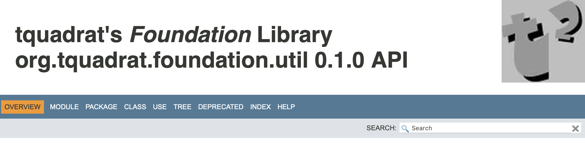

# Gradle Hacks

Some solutions for problems I had with Gradle. They work for me …

* * * * *

## JavaDoc

### `doc-files` in JavaDoc

You can provide additional files for the JavaDoc documentation of your project (and only to the documentation) by creating a folder with the name `doc-files` in the respective `package` folder and copying the files there.

From the JavaDoc in your source file, your refer to these files like this: `<a href="doc-files/docFile.xyz">Link to File</a>`.

Although the `javadoc` tool itself still supports this, it does not work properly when used with Maven or Gradle.

Maven is using a special copy operation that takes care of the additional files, but for Gradle I had to create my own solution[^alternate].

[^alternate]: Meanwhile I got a tip that Gradle's JavaDoc task should work on `project.sourceSets.main.getAllJava()` instead of on `projects.sourceSets.main.getAllSource()`. If true, it should help if I add all the `doc-files` folders and their contents to the source set. I need to test this …

The first approach looked like this:

```groovy
tasks.named( 'javadoc' ) {
    mustRunAfter "jar"

    //---* Configure JavaDoc *-------------------------------------------------
    …
    doLast {
        …
    
        copy {
            from "$projectDir/src/main/java"
            into "$project.docsDir/javadoc"
            include "**/doc-files/*"
        }
    }
}
```
It worked for projects that did not define a Java 9 (Jigsaw) module. The reason is that for a module the HTML files for the documentation are kept in a folder that is named after the module.

To illustrate that, the directory trees for a project with just the class `foo.bar.Main`, first without a module, then with the module `my.module`:

<table>
    <tr>
        <th>Without module</th><th>With module</th>
    </tr>
    <tr>
        <td><pre><tt>
└ javadoc
  ├ index-files
  ├ legal
  ├ foo
  │ └ bar
  │   ├ class-use
  │   └ Main.html
  &vellip;
  ├ allclasses-index.html
  &vellip;
  └ type-search-index.js 
</tt></pre></td>
        <td><pre><tt>
└ javadoc
  ├ index-files
  ├ legal
  ├ my.module
  │ ├ module-summary.html
  │ └ foo
  │   └ bar
  │     ├ class-use
  │     └ Main.html
  &vellip;
  ├ allclasses-index.html
  &vellip;
  └ type-search-index.js 
</tt></pre></td>
    </tr>
    
</table>

Unfortunately, there is no method in Gradle to get the Java module name; ok, the convention is to name the module after the project's main package, and I have the convention to name the project after the module … but at the same time, I have multi-module (this time Gradle modules) projects where the projects have modules or not (so for example, annotation processors do not work well when implemented as a module …).

So I used this method to obtain the module name[^groovy]:

[^groovy]: Sorry, but my Groovy skills are still … poor, at best. But of course, the method can be implemented in Groovy, too.

```java
/**
 *  Determines the module name of a Java 9 (Jigsaw) module
 *  (don't mix this up with a module as it is defined by Gradle
 *  itself!)}.
 *  The implementation will search the source path for a file with the
 *  name "module-info.java" and gets the name of the module from there.
 *  Call this function from your build.gradle file like this:
 *
 *      var moduleName = Tools.obtainModuleName( project.sourceSets.main )
 *
 *  @param  sourceSet   The source set for the project.
 *  @return An instance of
 *      {@link Optional}
 *      that holds the name of the module.
 */
public static final Optional<String> obtainModuleName( final SourceSet sourceSet )
{
    Optional<String> retValue = Optional.empty();

    final var directorySet = sourceSet.getAllJava();
    final var moduleDefinitionFile = directorySet.getFiles()
        .stream()
        .filter( File::exists )
        .filter( File::isFile )
        .filter( f -> f.getName().equals( MODULE_DEFINITION ) )
        .findFirst()
        .map( File::toPath );
    if( moduleDefinitionFile.isPresent() )
    {
        try( final var lines = lines( moduleDefinitionFile.get() ) )
        {
            final var contents = lines.collect( joining() );
            final var pattern = compile( ".*module\\s+(\\S+)\\s*\\{.*" );
            final var matcher = pattern.matcher( contents );
            if( matcher.matches() )
            {
                retValue = Optional.ofNullable( matcher.group( 1 ) );
            }
        }
        catch( final IOException e )
        {
            throw new Error( e );
        }
    }

    //---* Done *----------------------------------------------------------
    return retValue;
}   //  obtainModuleName()
```

It lives in a class named `org.tquadrat.build.Tools` in my case; that allows me to write the copy command like this now:

```groovy
tasks.named( 'javadoc' ) {
    mustRunAfter "jar"

    //---* Configure JavaDoc *-------------------------------------------------
    …
    doLast {
        …
    
        var moduleName = org.tquadrat.build.Tools.obtainModuleName( project.sourceSets.main )
        var targetDir = moduleName.map( "/%s"::formatted ).orElse( "" )
        copy {
            from "$projectDir/src/main/java"
            into "$project.docsDir/javadoc$targetDir"
            include "**/doc-files/*"
        }
    }
}
```

* * *

### Integration of a Logo into the Documentation

I want to have a logo on each page of the JavaDoc documentation for my projects, so that it looks like this:



To achieve this, my JavaDoc task in Gradle looks like this:

```groovy
tasks.named( 'javadoc' ) {
    String topValue = """
      <div style="overflow:auto;">
          
          <p style="font-family:sans-serif;font-size:40px;font-weight:bold;padding-left:30px;">My Library</p>      
      </div>
      """
      
    options {
        …
        addStringOption( 'top', topValue )
        …
    }

    doLast {
        copy {
            from "$projectDir/../resources/javadoc/logo.jpg"
            into "$project.docsDir/javadoc/resources"
        }
    }
}
```

The HTML code in `topValue` can be adjusted according to individual needs. Also the source location for the logo can be different.

