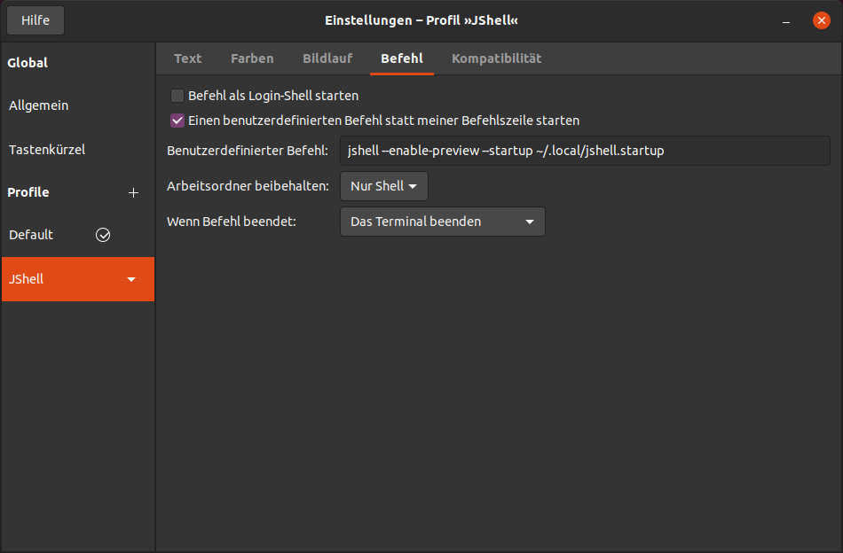

# JShell Startup Configuration

The Java `jshell` tool is useful for rapid prototyping of simple Java code, or for testing some functionality. An introduction can be found [here](https://docs.oracle.com/en/java/javase/26/jshell/introduction-jshell.html).

## Ubuntu Setup
On Ubuntu, I configured the Terminal application to have a special `JShell` terminal, like shown in the screenshot below. It is from the Ubuntu terminal application, and – as you may have noticed already – in German:



`JShell` starts there with this command:

```shell
jshell --enable-preview --enable-preview --startup DEFAULT --startup PRINTING --startup TOOLING --startup ~/.local/jshell.startup
```

## Raspberry Pi OS Setup
On the Raspberry, the setup is a little bit different; there I creates a shell script in the `~/bin` folder, usually named `jshell` (to work as expected requires that the `$PATH` variable mentions `~/bin` before `/usr/bin`).

That script looks like this:

```shell
#!/bin/bash
PRG="/usr/bin/jshell"
SCRIPT_DIR="$(cd "$(dirname "${BASH_SOURCE[0]}")" && pwd)"
STARTUP="$SCRIPT_DIR/jshell.startup"
$PRG --enable-preview --enable-preview --startup DEFAULT --startup PRINTING --startup TOOLING --startup $STARTUP $*
``` 
It expects that the file `jshell.startup` is stored in `~/bin`, too.

## The `jshell.startup` File
For Ubuntu, the file should be stored in `~/.local` (in particular when the setup described [above](#ubuntu-setup) is used), while on Raspberry Pi OS I recommend to store it with the described startup shell script in `~/bin`.

The file `jshell.startup` then looks like this; it provides some [additional commands](#additional-commands), too:

```Java
import module java.base; // Usually loaded already through DEFAULT

import static java.lang.IO.*;
import static java.lang.Math.*;
import static java.lang.System.*;
import static java.nio.file.Files.*;
import static java.time.temporal.ChronoUnit.*;
import static java.util.Objects.*;
import static java.util.regex.Pattern.*;

void listEnv() {
  final var properties = getenv().keySet()
    .stream()
    .map( Object::toString )
    .sorted()
    .toArray( String []::new );
  var maxLen = -1;
  for( final var property : properties ) maxLen = max( maxLen, property.length() );
  ++maxLen;   
  final var halfCount = properties.length / 2;
  final var offset = halfCount + properties.length % 2;
  final var lineTemplate = " - %1$s%3$s - %2$s%n";
  for( var i = 0; i < halfCount; ++i )
  {
    printf( lineTemplate, properties [i], properties [i + offset], " ".repeat( maxLen - properties [i].length() ) );
  }
  if( offset != halfCount ) printf( " - %s%n", properties [halfCount] );
}

void listProperties() {
  final var properties = getProperties().keySet()
    .stream()
    .map( Object::toString )
    .sorted()
    .toArray( String []::new );
  final var halfCount = properties.length / 2;
  final var offset = halfCount + properties.length % 2;
  final var lineTemplate = " - %1$s%3$s - %2$s%n";
  for( var i = 0; i < halfCount; ++i )
  {
    printf( lineTemplate, properties [i], properties [i + offset], " ".repeat( 30 - properties [i].length() ) );
  }
  if( offset != halfCount ) printf( " - %s%n", properties [halfCount] );
}

{
  final var user = getProperty( "user.name" );
  final var language = getProperty( "user.language" );
  final var country = getProperty( "user.country" );
  final var home = Path.of( getProperty( "user.home" ) ).toAbsolutePath().normalize();
  final var cwd = Path.of( getProperty( "user.dir" ) ).toAbsolutePath().normalize();
  final var temp = Path.of( getProperty( "java.io.tmpdir" ) ).toAbsolutePath().normalize();
  final var javaHome = Path.of( getProperty( "java.home" ) ).toAbsolutePath().normalize();
  final var classpath = getProperty( "java.class.path" );
  final var fileEnc =  getProperty( "file.encoding" );
  final var stdoutEnc =  getProperty( "stdout.encoding" );
  final var stderrEnc =  getProperty( "stderr.encoding" );
  final var stdinEnc =  getProperty( "stdin.encoding" );
  
  final var previewStatus = ProcessHandle.current().info().arguments().map( args -> Arrays.stream( args ).anyMatch( "--enable-preview"::equals ) );
  final var preview = previewStatus.isEmpty() ? "unknown" : Boolean.toString( previewStatus.get() );

  printf( """
    |  User ............: %s
    |  Language ........: %s
    |  Country .........: %s
    |  Home Directory ..: %s
    |  Current Directory: %s
    |  JAVA_HOME .......: %s
    |  CLASSPATH .......: %s
    |  File Encoding ...: %s
    |  out Encoding ....: %s
    |  err Encoding ....: %s
    |  in Encoding .....: %s
    |  Preview enabled .: %s
    |
    """, user, language, country, home, cwd, javaHome, classpath, fileEnc, stdoutEnc, stderrEnc, stdinEnc, preview );

  for( final var path : Set.of( "bin", ".local", ".config" ) )
  {
    final var startupFile = home.resolve( path, "jshell.startup" );
    if( !exists( startupFile ) ) continue;
    printf( """
      |  The startup options were loaded from "%s".
      |  -----
      """, startupFile );
    lines( startupFile )
      .filter( line -> line.startsWith( "import" ) )
      .map( "|    %s"::formatted )
      .forEach( out::println );
    break;    
  }
  println( "|  -----\n|" );
}
```
Basically, it can contain any arbitrary Java code that will be executed when JShell comes up.

## Additional Commands
The `jshell.startup` shown above, together with the startup scripts `PRINTING` and `TOOLING`, provide a bunch of additional commands that can be used in `jshell`.

`PRINTING` allows to use `print()`, `println()` and `printf()` directly, without prefixing the commands with "`System.out.`".

`TOOLING` provides the commands
 - `jar(String... args)`
 - `javac(String... args)`
 - `javadoc(String... args)`
 - `javap(String... args)`
 - `jdeps(String... args)`
 - `jlink(String... args)`
 - `jmod(String... args)`
 - `jpackage(String... args)`
 - `javap(Class<?> type)`

`tools()` list all available tools, and with `run(String name, String... args)` it is possible to run a tool that does not have a predefined command.

The commands that come with `jshell.startup` are:
 - `listEnv()` to list all environment variables (use `System.getenv()` to retrieve the values)
 - `listProperties()` to list all system properties (use `System.getProperty()` to retrieve the values)
